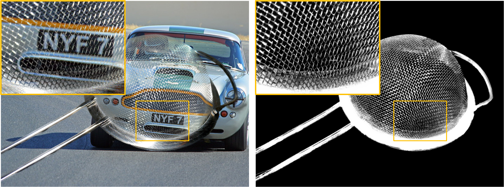

# A<sup>2</sup>U Matting

<p align="center">
  
</p>

The official repository for paper:

[**Learning Affinity-Aware Upsampling for Deep Image Matting**](https://arxiv.org/pdf/2011.14288.pdf) (to appear in CVPR2021).


## Citation
If you find this work or code useful for your research, please consider citing:
```
@article{dai2020learning,
  title={Learning Affinity-Aware Upsampling for Deep Image Matting},
  author={Dai, Yutong and Lu, Hao and Shen, Chunhua},
  journal={arXiv preprint arXiv:2011.14288},
  year={2020}
}
```
